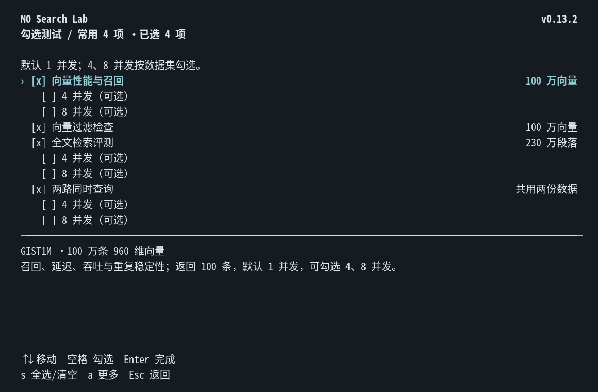
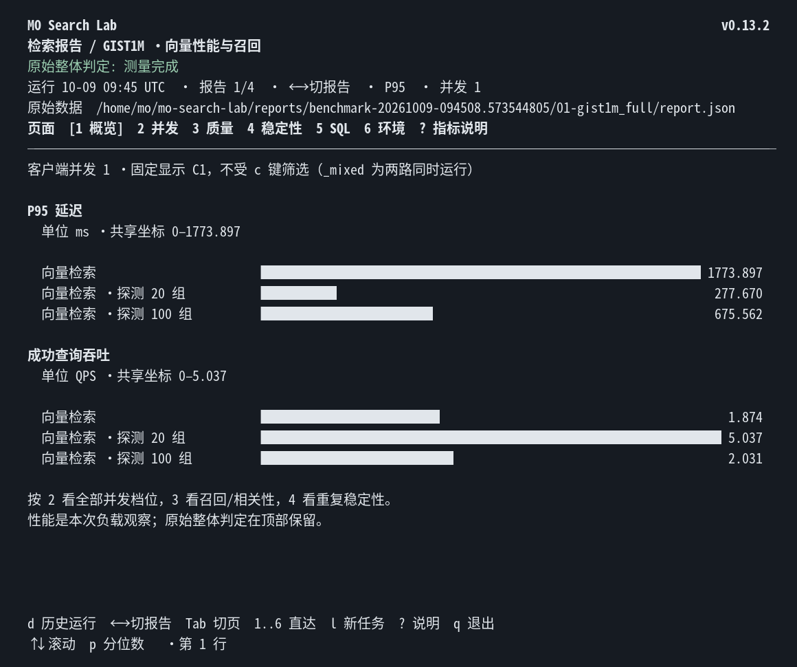
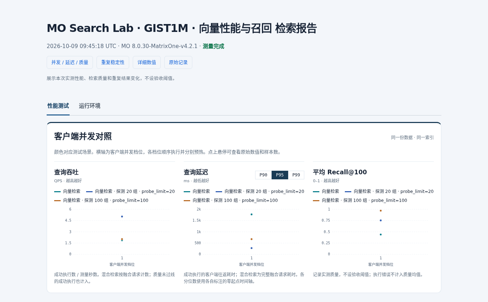
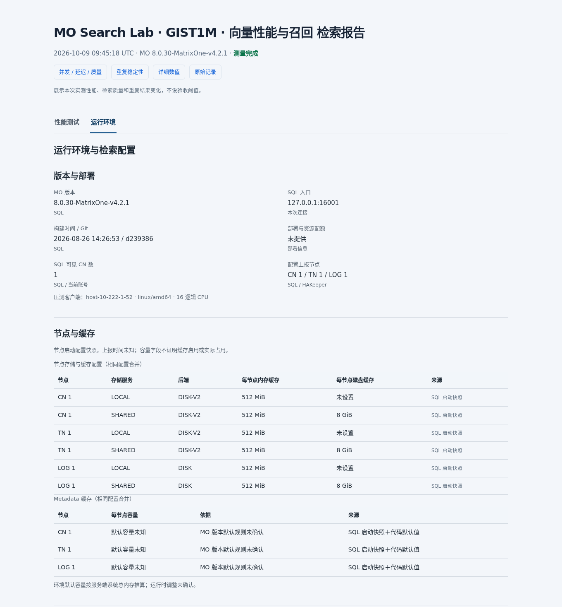

# MO Search Lab

MO 全文与向量能力的性能评测、问题复现和调查工具。连接已有 MatrixOne 服务，导入公开数据包，测量检索质量、延迟、吞吐和重复结果稳定性，生成原始 JSON、离线 HTML 图表和交互式终端报告。

这是独立 Git 仓库和独立 Go module。运行器通过 MySQL 协议连接 MO，源码和构建依赖均不引用 MatrixOne 内核。

## 现场 Quick Start

现场需要二进制、提前准备的数据包和可访问的 MO SQL 服务。执行性能测试的账号需要建库、建表、建索引、导入、查询及删库权限。现场无需 Go、Python、ES、模型或互联网。

解压交付包，校验后启动交互界面：

```bash
sha256sum -c SHA256SUMS
./mo-search-lab version
./mo-search-lab ui --launch --reports reports --packs packs \
  --host 10.0.0.10 --port 6001 --user BENCH_USER --password '你的密码'
```

把地址、端口和账号替换为现场连接信息；数据包另放时，将 `--packs` 指向实际的数据包根目录。`make release` 生成的工具包只含二进制和 `packs/smoke` 的 8 行流程样本，大数据包另外交付。完整 datasets-v1 现场包包含过滤、全文、两路测试三个 pack，解压后唯一文件内容约 15.73 GB；MO 存储另需容纳导入数据和索引。

### 选择并运行测试

1. 表单中选择“性能测试”或只读“环境检查”，`↑↓` / `Tab` 移动，`Enter` 编辑字段。
2. 在测试项目字段按 `Enter` 或 `Ctrl-P` 打开列表。首次默认勾选全部已安装常用测试；`空格` 勾选，`s` 全选或清空，`Enter` 确认，`Esc` 恢复进入前的选择。
3. 每个项目默认只跑 **1 并发**。需要时勾选数据集下面的 **4、8 并发**；过滤检查保持串行。`a` 展开小样本、分词对比和历史实验包，这些默认不勾选。
4. 选中“开始运行”并按 `Enter`。项目依次执行，显示当前项目、阶段和耗时；`Esc` / `Ctrl-C` 取消后等待当前项目清理和保存，后续项目停止。

两路同时查询项目自动使用 `vector,fulltext`。多项完成后进入本次结果列表，`Enter` 看报告、`t` 返回；单项完成后直接打开报告。每项独立保存报告，多项运行的 `batch.json` 保存汇总关系和执行状态。

不加 `--launch` 时先打开最新报告；交互终端中没有报告时自动打开表单。查看历史报告无需连接 MO。`ui --pack DIR` 只预选指定包，也可在表单的测试项目字段按 `p` 输入单个路径。

### 默认值与测量范围

| 项目 | 默认值 |
| --- | --- |
| SQL 连接 | `127.0.0.1:6001`，账号 `root`，空密码 |
| 普通查询 | 所选 pack 的全部查询，每条测量 1 次 |
| 客户端并发 | 1；4、8 并发需主动选择 |
| 预热 | 每个场景/并发档位 5 次，不计入测量 |
| 独立稳定性 | 最多 5 条查询，各重复 30 次，始终串行 |
| 查询/执行计划超时 | 3 分钟；导入和建索引使用其 10 倍预算 |
| 测试库 | 自动创建，默认结束后删除；可选保留 |

`run`、`inspect` 和 `ui` 都通过 `--password` 直接传入 SQL 密码；省略为空密码。UI 遮蔽显示并允许修改，密码不写入报告。

质量和稳定性作为观测值，不设置验收断言。数据准备、连接、SQL 或清理错误影响完成状态；召回不足或结果变化写入指标及 `observations`。旧报告保留原有判定，旧数据包的 SQL、查询、真值与校验和保持兼容。

“更多设置”可减少查询数和重复数，但仍导入全量数据并建立索引。普通查询和稳定性使用独立预算；只减少普通查询数，不会减少稳定性的默认 5 × 30 次测量。

## 界面与报告预览

以下为 v0.13.2 的实际界面。报告数值来自本地公开数据集测量，用于展示报告布局，不作为客户现场的验收标准。

### CLI：勾选测试与并发

常用项目集中展示，默认勾选；4、8 并发作为各数据集的可选子项。焦点下方说明数据规模与测量范围，底部保留操作提示。



<details>
<summary>展开 CLI 报告示例</summary>

报告概览用横向柱状图展示单并发延迟与吞吐，数值列对齐。页头标明当前 run、报告序号和页面；左右切报告，Tab 切页面，`d` 选历史 run。



</details>

### HTML：性能图表与独立环境页

性能报告以图表为主，按测试场景区分颜色；延迟可以切换 P90/P95/P99。顶部的“性能测试 / 运行环境”切换同一次运行的测量与配置，详细数值和原始记录保留查看入口。



<details>
<summary>展开运行环境页示例</summary>

环境页按版本与部署、节点与缓存、检索参数及资源监控分区。相同节点配置合并展示，配置来源、默认值与未知项明确标注。



</details>

## 看报告与管理历史

```bash
./mo-search-lab ui --reports reports
./mo-search-lab ui --report-dir reports/某次运行
./mo-search-lab ui --reports reports --plain --section stability
```

历史按一次运行分组，显示时间、报告数和总耗时；独立报告算一次运行。`--report-dir` 可指向整次运行目录或其中一份报告。左右切报告时保留当前页面，切换历史运行时优先保留同一数据集。

| 按键 | 操作 |
| --- | --- |
| `d` | 选择历史 run；`↑↓` 选择、`Enter` 打开、`Esc` 返回 |
| `← / →` | 切换该 run 内的测试报告 |
| `Tab / Shift-Tab` | 当前报告的下一页 / 上一页 |
| `1–6` | 直达概览、并发、质量、稳定性、SQL、环境 |
| `l / t` | 启动新任务 / 返回本次测试结果 |
| `p / c` | 概览或并发页切 P90/P95/P99 / 并发或质量页筛选并发 |
| `? / q` | 指标说明 / 退出 |

**删除只在 `d` 历史列表中操作**：`x` / `Delete` 预览整次删除范围，`y` 确认，`Enter` / `n` / `Esc` 取消。确认后永久删除这次运行的全部报告目录、JSON、HTML、附带记录及 `batch.json`，列表自动刷新。删除前检查整组范围，包含数据文件、未确认条目或已变化文件时拒绝删除。

`ui --concurrency N` 仅筛选已有报告的已测并发，**不控制新任务并发**。新任务的并发在测试列表勾选。`--dataset` 和 `--scenario-id` 使用原始 ID，显示名称用于阅读。`NO_COLOR=1` 关闭终端颜色；非交互终端自动输出纯文本，`--launch` 需要交互终端。界面最小 40 列 × 12 行。

浏览器直接打开每份报告的 `report.html`，顶部 **性能测试 / 运行环境** Tab 显示同一次运行的图表与配置。HTML 自包含，可离线查看；远程运行后可用 SSH/SFTP 拷回报告目录。`report.json` 保存原始测量、SQL、输入校验和和执行计划。单份报告可用 `render --report-dir DIR` 更新 HTML，不重跑 SQL。

## 命令行与 help

```bash
./mo-search-lab --help
./mo-search-lab help ui
./mo-search-lab run --help
```

| 命令 | 用途 |
| --- | --- |
| `ui` | 交互式启动测试、检查环境、查看和管理报告 |
| `run` | 执行一个数据包；`--pack DIR` 必填 |
| `inspect` | 只读环境采集，无需数据包 |
| `validate` | 校验数据包与输入 SHA-256，不连接 MO |
| `render` | 从单份报告的 `report.json` 更新 HTML |
| `version` | 显示工具版本 |

### 脚本运行

```bash
# Bash；替换地址、端口及账号。
CONN=(--host 10.0.0.10 --port 6001 --user BENCH_USER --password '你的密码')

./mo-search-lab run "${CONN[@]}" \
  --pack packs/gist_1m_filtered_v7 --report-dir reports/filter-001
./mo-search-lab run "${CONN[@]}" \
  --pack packs/t2ranking_anli_full_500q_ngram_v3 --report-dir reports/t2-001
./mo-search-lab run "${CONN[@]}" \
  --pack packs/gist_t2_sql_workload_v7 --mixed-scenarios vector,fulltext \
  --report-dir reports/mixed-001
```

每个 `run` 校验输入、建测试库、导入、建索引、预热、测量、保存报告并清理测试库。报告目录每次用新路径；`--keep-db` 保留库以便调查。

需要多并发时显式追加 `--concurrency-levels 1,4,8`；它优先于 `--concurrency`。稳定性始终串行。时间紧时可追加 `--query-limit 20 --stability-repeat 10`；稳定性查询数另用 `--stability-query-limit` 设置。设为 `0` 时继承普通查询的对应预算，重复数仍需满足包内最小要求。两路 pack 在脚本中需显式指定 `--mixed-scenarios vector,fulltext`。

## MO 环境与配置

`run` 自动采集 MO 版本、构建信息、选定 SQL 默认变量、账号可见 CN 及节点上报的缓存/内存配置。也可先做只读检查：

```bash
./mo-search-lab inspect "${CONN[@]}" \
  --mo-config /path/to/cn.toml --report-dir reports/environment-001
```

`--mo-config` 可重复提供多个本地 TOML 文件；`--environment-file` 补充部署与资源声明；`--monitoring-config` 接入指定 Grafana/Prometheus 监控。三者均可省略，也可用于 `run` 或 UI 表单。配置标为启动上报快照，来源与默认值明确区分；缺失信息标为未知，不采集 Iceberg、ETL 或 TMP 配置。

报告按版本与部署、节点与缓存、检索参数、资源监控分区。差异、异常节点和采集失败集中在“诊断详情”；CLI 环境页按 `e`，纯文本追加 `--environment-details`。格式及默认容量规则见 [环境与配置说明](docs/environment.md)。

## 数据包

公开数据包：[datasets-v1 Release](https://github.com/matrixorigin/mo-search-lab/releases/tag/datasets-v1)。下载、分卷合并及校验见 [数据包分发说明](docs/datasets.md)。

| 测试项目 | 数据与用途 | datasets-v1 |
| --- | --- | --- |
| GIST1M · 向量性能与召回 | 100 万条、960 维向量；召回、延迟、并发、稳定性 | 需另行准备 health Top-100 包 |
| GIST1M · 向量过滤检查 | 相同规模；串行 PRE/POST 与可见比例检查 | 包含 |
| T2Ranking · 全文检索评测 | 230 万段落、500 条冻结查询与标注；anli 形态 TF-IDF/BM25 | 包含 |
| GIST + T2Ranking · 两路同时查询 | 共享前两份 CSV；独立 SQL 同时执行的延迟与吞吐 | 包含 |

数据包和结果存放在源码仓库之外，通过 `--packs` / `--pack` 和报告路径指定。共享交付应保留 CSV 硬链接。稳定性与召回/相关性分别观察；并发数表示客户端请求数，不等于 CN 数量。

## 开发与构建

构建使用本仓库的 `go.mod`、`go.sum`，关闭父目录 Go workspace；客户执行仅需二进制和数据包。

```bash
make check        # Go 测试、vet、格式检查及 Python 脚本测试，无需 MO 服务
make build        # 本机二进制
make release      # dist/ 下的 Linux amd64 工具包及 SHA-256
./mo-search-lab validate --pack cmd/mo-search-lab/testdata/smoke
```

默认版本为 v0.13.2，可用 `make release VERSION=v0.13.2` 指定。小样本仅验证流程，不用于客户性能结论。

## 目录与扩展

```text
cmd/mo-search-lab/  Go 运行器、报告、终端界面、单元测试、小样本
tools/             离线数据准备、报告发布、独立复算及其测试
docs/design/       pack/报告/稳定性设计与仓库迁移记录
scripts/           发布打包
.github/workflows/ 独立构建与测试 CI
go.mod / go.sum    工具自己的依赖
```

客户新问题通常通过新增场景 JSON、固定查询 JSONL、真值及 manifest 校验和加入数据包；可选 `pack-info.json` 提供显示名称。新增指标或检查类型时扩展运行器及测试。

详细参数、pack schema 和测量口径见 [运行器参考](cmd/mo-search-lab/README.md)，迁移来源见 [独立仓库设计](docs/design/standalone_repository.md)，定位见 [MO Search Lab](docs/design/search_lab_name.md)。

## License

继承原工具的 [Apache License 2.0](LICENSE) 和 Matrix Origin 版权声明。公开数据集的许可与来源随各自数据包记录。
